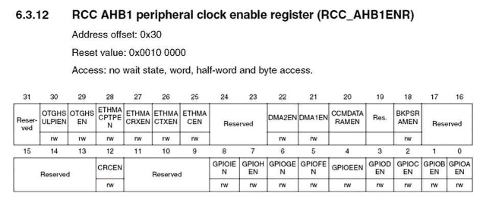
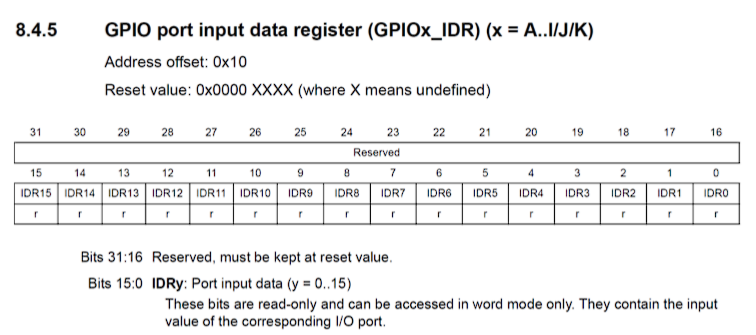

# GPIO – General Purpose Input / Output

Bevor GPIO-Pins konfiguriert oder verwendet werden können, muss die zugehörige Hardwareeinheit im Mikrocontroller aktiviert werden. Dies erfolgt über das RCC-Register.

---

## RCC-Register – Aktivierung der GPIO-Hardware

Das RCC-Register (Reset and Clock Control) steuert unter anderem die Taktversorgung interner Peripherieeinheiten.  
Eine Peripherieeinheit muss immer zuerst im RCC aktiviert werden, bevor ihre Register beschrieben oder gelesen werden können.

Für GPIO-Ports geschieht dies über das Register `RCC_AHB1ENR`.

### Beispiel: GPIOA aktivieren

~~~c
RCC->AHB1ENR |= (1 << 0);   // GPIOA aktivieren
~~~

Wird der GPIO-Port nicht aktiviert, haben Zugriffe auf die GPIO-Register keine Wirkung.

Optional kann die Peripherie auch wieder deaktiviert werden:

~~~c
RCC->AHB1ENR &= ~(1 << 0);  // GPIOA deaktivieren
~~~

---

## GPIO – Allgemeines

Über GPIO-Pins (General Purpose Input/Output) kann der Mikrocontroller mit externen Bauteilen kommunizieren.  
GPIO-Pins dienen als universelle digitale Ein- und Ausgänge.

Ein GPIO-Pin kann beispielsweise:
- als **Eingang (INPUT)** konfiguriert werden, um externe Signale einzulesen
- als **Ausgang (OUTPUT)** konfiguriert werden, um Signale auszugeben (z. B. LEDs schalten)

Damit der Mikrocontroller weiß, wie ein GPIO-Pin verwendet werden soll, muss dieser zunächst über entsprechende Register konfiguriert werden.

---

## GPIO-Register – Überblick

Für die Konfiguration und Nutzung der GPIO-Pins stehen mehrere Register zur Verfügung:

- **MODER** – legt die Betriebsart eines Pins fest  
- **ODR** – setzt den Ausgangspegel eines Pins  
- **IDR** – liest den aktuellen Eingangszustand eines Pins  
- **PUPDR** – aktiviert interne Pull-Up- oder Pull-Down-Widerstände  

Jeder GPIO-Port (z. B. GPIOA, GPIOB, …) besitzt seine eigenen Register.

---

## MODER-Register – Betriebsart eines Pins

Die Betriebsart eines GPIO-Pins wird im `GPIOx_MODER`-Register eingestellt.

Für **jeden Pin werden zwei Bits** verwendet.  
Die Kombination dieser beiden Bits legt fest, wie der Pin arbeitet.

| Modus    | Bitwert |
|---------|---------|
| Eingang | 00 |
| Ausgang | 01 |

Hinweis:  
Nach einem Reset sind alle GPIO-Pins standardmäßig als Eingang konfiguriert. (Ausnahme: Port B, siehe Reset Value)

---

### Beispiel: GPIOA Pin 5 konfigurieren

PA5 verwendet die Bits **10 und 11** im MODER-Register.

#### PA5 als Ausgang konfigurieren

~~~c
GPIOA->MODER |= (1 << (5 * 2));    // Bitmuster 01
~~~

#### PA5 als Eingang konfigurieren

~~~c
GPIOA->MODER &= ~(3 << (5 * 2));   // beide Bits auf 0 setzen
~~~

Die Zahl `3` entspricht dem Binärwert `11` und löscht beide Bits des Pins.

---

## GPIO-Pin verwenden

Nachdem die Betriebsart eines GPIO-Pins festgelegt wurde, kann der Pin aktiv genutzt werden.

Je nach Konfiguration erfolgt der Zugriff über unterschiedliche Register.

---

## Output Data Register (ODR)

Das `GPIOx_ODR`-Register steuert den Ausgangszustand eines Pins.

- 1 = Pin auf High  
- 0 = Pin auf Low  

### Beispiel: PA5 ansteuern

~~~c
GPIOA->ODR |=  (1 << 5);   // PA5 auf High setzen
GPIOA->ODR &= ~(1 << 5);   // PA5 auf Low setzen
~~~

---

## Input Data Register (IDR)

Über das `GPIOx_IDR`-Register wird der aktuelle Pegel eines GPIO-Pins gelesen.

- 1 → Am Pin liegt High an  
- 0 → Am Pin liegt Low an  

Da das IDR-Register mehrere Pins gleichzeitig enthält, wird beim Auslesen eine **Bitmaske** verwendet, um genau den gewünschten Pin zu prüfen.

---

### Bitmaske beim Einlesen eines Pins

Die Bitmaske wird mit einer Linksverschiebung erzeugt:

~~~text
1 << 5   = 00000000 00000000 00000000 00100000
~~~

Diese Maske besitzt genau an der Stelle des gewünschten Pins eine 1, alle anderen Bits sind 0.

Durch eine bitweise UND-Verknüpfung mit dem IDR-Register bleiben nur die Informationen dieses Pins erhalten.

---

### Beispiel: PA5 einlesen

~~~c
if (GPIOA->IDR & (1 << 5)) {
    // PA5 ist High
}
~~~

Ablauf:
1. Das komplette IDR-Register wird gelesen  
2. Die Bitmaske `(1 << 5)` filtert alle anderen Pins heraus  
3. Ist das Ergebnis ungleich 0, liegt an PA5 ein High-Pegel an  

---

### Beispiel: PA5 auf Low prüfen

~~~c
if (!(GPIOA->IDR & (1 << 5))) {
    // PA5 ist Low
}
~~~

Hier wird das Ergebnis der UND-Verknüpfung logisch invertiert:

- `&`  = bitweises UND  
- `!`  = logische Verneinung  
- `1 << n` = Bitmaske für Pin n  

Ist das Ergebnis 0, liegt am Pin ein Low-Pegel an.

---

## Pull-Up / Pull-Down Widerstände

Wird ein GPIO-Pin als **Eingang** verwendet, liest der Mikrocontroller lediglich den anliegenden elektrischen Pegel.  
Ist der Pin jedoch nicht aktiv mit einer Spannung verbunden, hat er **keinen definierten Zustand**.

Ein solcher Eingang wird als **floating** bezeichnet.  
Ein floating Pin kann zufällig zwischen High und Low wechseln und dadurch falsche Zustände liefern.

---

### Warum Pull-Widerstände notwendig sind

Betrachten wir einen Taster, der beim Drücken den GPIO-Pin mit der Versorgungsspannung verbindet:

- **Taster gedrückt**  
  Der Pin ist direkt mit VCC verbunden → High

- **Taster nicht gedrückt**  
  Der Pin ist elektrisch offen → undefinierter Zustand

Ohne weitere Maßnahme weiß der Mikrocontroller in diesem Zustand nicht, ob der Pin als 0 oder 1 interpretiert werden soll.

---

### Funktionsprinzip von Pull-Up und Pull-Down

Pull-Widerstände verbinden den GPIO-Pin **schwach** mit einem festen Pegel:

- **Pull-Up** verbindet den Pin über einen Widerstand mit VCC  
- **Pull-Down** verbindet den Pin über einen Widerstand mit GND  

Der Widerstand ist dabei so groß gewählt, dass:
- der Pegel im Ruhezustand eindeutig ist
- ein externer Schalter oder Sensor den Pegel problemlos überschreiben kann

---

### Typische Anwendung

- **Pull-Down**  
  - Ruhezustand: Low  
  - Taster gedrückt: High  

- **Pull-Up**  
  - Ruhezustand: High  
  - Taster gedrückt: Low  

Welche Variante verwendet wird, hängt von der gewünschten Logik und der externen Beschaltung ab.

---

## PUPDR-Register – Pull-Up / Pull-Down einstellen

Die internen Pull-Widerstände werden über das `GPIOx_PUPDR`-Register konfiguriert.

Für **jeden GPIO-Pin werden zwei Bits verwendet**.  
Die Kombination dieser beiden Bits legt fest, welcher Pull-Widerstand aktiv ist.

| Bitkombination | Bedeutung |
|---------------|-----------|
| 00 | kein Pull-Widerstand (floating) |
| 01 | Pull-Up aktiviert |
| 10 | Pull-Down aktiviert |
| 11 | reserviert |

---

### Beispiel: GPIOA Pin 5 konfigurieren

#### Pull-Down aktivieren

~~~c
GPIOA->PUPDR |= (1 << (5 * 2 + 1));   // Bitmuster 10
~~~

Erklärung:
- Das höherwertige Bit wird auf 1 gesetzt
- Das niederwertige Bit bleibt 0
- Ergebnis: Pull-Down aktiv

---

#### Pull-Up aktivieren

~~~c
GPIOA->PUPDR |= (1 << (5 * 2));       // Bitmuster 01
~~~

Erklärung:
- Das niederwertige Bit wird auf 1 gesetzt
- Das höherwertige Bit bleibt 0
- Ergebnis: Pull-Up aktiv

---

#### Pull-Widerstand deaktivieren

~~~c
GPIOA->PUPDR &= ~(3 << (5 * 2));      // Bitmuster 00
~~~

Erklärung:
- Beide Bits des Pins werden auf 0 gesetzt
- Der Pin ist wieder floating

