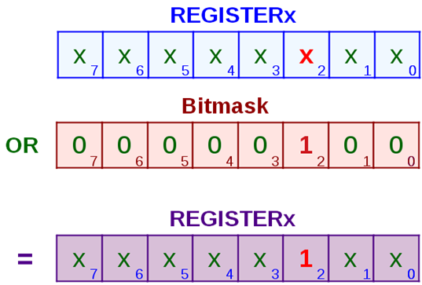

# Grundlagen: Registerprogrammierung

## Was ist ein Mikrocontroller und wie wird er gesteuert?

Ein Mikrocontroller (µC) ist ein kleiner Computer auf einem Chip.  
Er enthält einen Prozessor, Speicher und verschiedene Ein- und Ausgänge, mit denen er mit der Außenwelt kommunizieren kann, z. B. um Sensoren auszulesen oder LEDs einzuschalten.

Im Gegensatz zu einem normalen PC ist ein Mikrocontroller sehr spezialisiert und wird oft in Geräten wie Steuerungen, Messsystemen oder Autos eingesetzt.

Damit der Mikrocontroller weiß, was er tun soll, wird er programmiert.  
Die inneren Funktionen des Mikrocontrollers werden über sogenannte Register gesteuert.

---

## Was ist ein Register?

Ein Register ist ein kleiner Speicherbereich im Mikrocontroller, mit dem direkt die Hardware gesteuert wird.  
Man kann sich ein Register wie eine Reihe von Ein- und Aus-Schaltern (Bits) vorstellen.

Ein Bit ist entweder 0 oder 1:

- 0 = Funktion aus / deaktiviert  
- 1 = Funktion an / aktiviert  

---

## Aufbau eines Registers

Die meisten Mikrocontroller verwenden 32-Bit-Register, also 32 einzelne Bits (Schalter) nebeneinander:

~~~text
01010101 01010101 01010101 01010101
~~~

In diesem Beispiel ist jedes zweite Bit auf 1 gesetzt, also aktiv, und die anderen Bits sind 0, also deaktiviert.

Ein Register ist somit nichts anderes als eine Aneinanderreihung von 0 und 1, wobei jedes Bit eine bestimmte Funktion ein- oder ausschalten kann.

Um zu verstehen, welches Register welche Funktion steuert und welche Bedeutung die einzelnen Bits haben, stellt der Hersteller des Mikrocontrollers Tabellen (Registerbeschreibungen) in der Dokumentation bereit.  
Dort ist genau aufgeführt, wofür das Register genutzt wird und welche Funktion ein bestimmtes Bit besitzt.

---

## Beispiel: OSPEEDR-Register

Im folgenden Beispiel sehen wir das OSPEEDR-Register, in dem die Geschwindigkeit (Output Speed) der GPIO-Leitungen eingestellt werden kann.  
Dieses Register wurde nur exemplarisch verwendet.

Man erkennt, dass es 32 Bit-Felder gibt, in die Werte eingetragen werden können.  
Die als „rw“ (read/write) gekennzeichneten Bits können sowohl gelesen als auch beschrieben werden.

In diesem Register gehören jeweils zwei Bits zu einem GPIO-Pin und legen gemeinsam die Ausgangsgeschwindigkeit fest.

Wenn wir die Geschwindigkeit von Pin 5 auf „Fast“ einstellen möchten, müssen die Bits 10 und 11 des Registers geändert werden.

Für den Modus „Fast“ muss eine 1 in das höherwertige Bit und eine 0 in das niederwertige Bit eingetragen werden.

Registerzustand (angenommen, alle Bits waren zuvor auf 0 gesetzt):

~~~text
Davor:   00000000 00000000 00000000 00000000
Danach:  00000000 00000000 00001000 00000000
~~~

Die 0 bleibt unverändert, die 1 wurde an der richtigen Bitposition gesetzt.  
Der Mikrocontroller hat damit für Pin 5 die Geschwindigkeit „Fast“ eingestellt, während alle anderen Pins weiterhin mit Low-Speed betrieben werden.

Beispiel:  
Für Pin 12 wurden Bit 24 und Bit 25 auf 1 gesetzt, damit der Mikrocontroller diesen GPIO-Pin im High-Speed-Modus betreibt.  
Alle anderen Bits bleiben unverändert.

~~~text
Davor:   00000000 00000000 00000000 00000000
Danach:  00000011 00000000 00000000 00000000
~~~

---

## Umsetzung im Code – Register richtig bearbeiten

Um Einstellungen im Mikrocontroller vorzunehmen, müssen wir die Register per Code verändern.

---

### Variante 1: Register komplett überschreiben

Mit folgendem Code überschreiben wir das komplette Register und alle Inhalte, die in diesem Register aktuell stehen:

~~~c
GPIOA->OSPEEDR = 0b00000000000000000000100000000000;
~~~

Dies bringt den Nachteil mit sich, dass zuvor gesetzte Bits an anderen Stellen wieder mit 0 überschrieben werden.  
Diese Methode ist daher in der Praxis nicht sinnvoll.

---

### Variante 2: Einzelne Bits gezielt ändern

Während beim direkten Überschreiben eines Registers der gesamte Inhalt ersetzt wird, kann man mit bitweisem ODER (`|`) gezielt einzelne Bits aktivieren, ohne die anderen zu verändern.

Für das Beispiel betrachten wir ein vereinfachtes Register mit 8 Bit:

~~~text
XXXX XXXX
~~~

`X` steht hierbei für einen unbekannten Wert, der bereits im Register steht.

Nun soll an der dritten Stelle (Bit 2) eine 1 geschrieben werden.  
Dazu wird das bestehende Register mit einer Bitmaske verodert.

Egal welcher Wert zuvor an den Stellen `X` stand, eine Veroderung mit 0 verändert den Wert nicht.  
An der Stelle, an der mit einer 1 verodert wird, entsteht unabhängig vom vorherigen Wert immer eine 1.

Eine Veroderung eignet sich daher, um gezielt einzelne Bits auf 1 zu setzen.

Soll ein Bit auf 0 gesetzt werden, muss eine bitweise UND-Verknüpfung verwendet werden.

---

### Umsetzung im Code

~~~c
register = register | 0b00000100;    // Bit 2 setzen (ODER)
register = register & 0b11111011;    // Bit 2 löschen (UND)
~~~

Kurzform:

~~~c
register |= 0b00000100;
register &= 0b11111011;
~~~

---

## Vereinfachung durch bitweise Verschiebung

Um den Code übersichtlicher zu gestalten, muss die Bitmaske nicht vollständig ausgeschrieben werden.  
Stattdessen kann sie durch eine bitweise Linksverschiebung erzeugt werden.

~~~text
1        = 00000001
1 << 2   = 00000100
~~~

Die Schreibweise `1 << n` bedeutet, dass die 1 um `n` Stellen nach links verschoben wird und genau an der gewünschten Bitposition steht.

---

## Anwendung im Code

Bit setzen (auf 1 schreiben):

~~~c
REGISTER |= (1 << 2);
~~~

Bit löschen (auf 0 setzen):

~~~c
REGISTER &= ~(1 << 2);
~~~

Der Operator `~` negiert alle Bits der Maske.  
Aus `00000100` wird `11111011`, wodurch das gewünschte Bit sicher auf 0 gesetzt wird.
