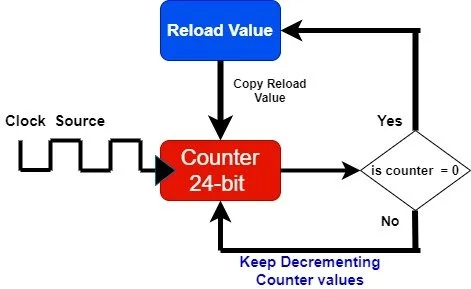

# **System Timer – SysTick Timer**

Alle ARM-Cortex-M Mikrocontroller besitzen einen einfachen Systemtimer, den **SysTick Timer**.  
Der SysTick Timer dient hauptsächlich zur **zeitlichen Steuerung von Programmen**, z. B. für:

- Zeitmessung
- periodische Interrupts
- einfache Delays
- Betriebssystem-Ticks (RTOS)

---

## Grundprinzip des SysTick Timers

Der SysTick Timer ist ein **24-Bit-Abwärtszähler**.

- Er zählt von einem Startwert (Reload-Wert) **bis 0**
- Bei Erreichen von 0:
  - wird ein **Interrupt ausgelöst**
  - der Zähler wird automatisch wieder mit dem Reload-Wert geladen
- Danach beginnt der Zählvorgang erneut

Der SysTick Timer läuft somit **periodisch**.

---

## Taktquelle des SysTick Timers

Der Takt für den SysTick Timer stammt vom **Systemtakt** des Mikrocontrollers.

- Der Systemtakt kann z. B. 16 MHz, 84 MHz oder bis zu 168 MHz betragen
- Der SysTick zählt mit dieser Taktfrequenz herunter

Beispiel bei 16 MHz:

~~~text
16 000 000 Takte pro Sekunde
→ 1 Takt = 62,5 ns
~~~

Wird der Reload-Wert auf 16 000 000 gesetzt, benötigt der Timer **genau 1 Sekunde**, um auf 0 herunterzuzählen.

---

## Reload-Wert und Zeitintervall

Der Reload-Wert bestimmt, **nach welcher Zeit ein Interrupt ausgelöst wird**.

Beispiel für einen 1-ms-Tick:

~~~text
Systemtakt: 16 MHz
Ticks pro Millisekunde: 16 000
~~~

Der Timer zählt dann:

~~~text
16 000 → 0  → Interrupt → Reload
~~~

Damit entsteht **alle 1 ms ein SysTick-Interrupt**.

---

## SysTick als Interruptquelle

Beim Übergang von `1 → 0` kann der SysTick Timer einen **Interrupt** auslösen.  
Dieser Interrupt wird in der Funktion `SysTick_Handler()` behandelt.

Diese Funktion wird **automatisch** aufgerufen, sobald der Interrupt auftritt.

---

## CMSIS und SysTick

Die Konfiguration des SysTick Timers erfolgt üblicherweise über die **CMSIS-Bibliothek**  
(Cortex Microcontroller Software Interface Standard).

CMSIS stellt eine einfache Funktion zur Verfügung:

~~~c
uint32_t SysTick_Config(uint32_t ticks);
~~~

Diese Funktion:
- setzt den Reload-Wert
- startet den SysTick Timer
- aktiviert den SysTick-Interrupt

---

## SysTick_Config – Funktionsprinzip

~~~c
SysTick_Config(SystemCoreClock / 1000);
~~~

Erklärung:
- `SystemCoreClock` enthält die aktuelle Systemtaktfrequenz
- Division durch 1000 ergibt die Anzahl der Takte für **1 ms**
- Der SysTick Interrupt wird damit **alle 1 ms ausgelöst**

---

## Beispiel: Zeitmessung mit SysTick

Im Unterricht wurde der SysTick verwendet, um eine **Millisekunden-Zeitbasis** zu erzeugen.

---

### Globale Variable

~~~c
volatile uint32_t msTicks;   // zählt die Millisekunden
~~~

- `volatile`, da die Variable im Interrupt verändert wird
- `msTicks` zählt die Anzahl der SysTick-Interrupts

---

### SysTick Interrupt Handler

~~~c
void SysTick_Handler(void)
{
    msTicks++;
}
~~~

Ablauf:
- Der SysTick Timer erreicht 0
- Interrupt wird ausgelöst
- `SysTick_Handler()` wird aufgerufen
- Zähler `msTicks` wird um 1 erhöht

Da der Interrupt alle 1 ms kommt, entspricht `msTicks` einer Millisekunden-Zeitbasis.

---

## Initialisierung des SysTick Timers

~~~c
void Init(void)
{
    RCC->AHB1ENR |= (1 << 3);      // GPIOD aktivieren
    GPIOD->MODER |= (1 << 24);     // PD12 als Ausgang

    SysTick_Config(SystemCoreClock / 1000);   // Interrupt alle 1 ms
}
~~~

- GPIO wird initialisiert
- SysTick Timer wird gestartet
- Ab jetzt läuft der SysTick Interrupt regelmäßig

---

## Delay-Funktion mit SysTick

Mit dem SysTick-Zähler kann eine einfache Delay-Funktion realisiert werden.

~~~c
void Delay(uint32_t dlyTicks)
{
    msTicks = 0;
    while (msTicks < dlyTicks)
    {
        // warten
    }
}
~~~

Funktionsweise:
1. `msTicks` wird auf 0 gesetzt
2. Der SysTick Interrupt erhöht `msTicks` jede Millisekunde
3. Sobald `msTicks` den gewünschten Wert erreicht, endet die Schleife

---

## Beispiel: LED blinken mit SysTick

~~~c
while (1)
{
    GPIOD->ODR |=  (1 << 12);   // LED an
    Delay(500);

    GPIOD->ODR &= ~(1 << 12);   // LED aus
    Delay(500);
}
~~~

- LED an für 500 ms
- LED aus für 500 ms
- Blinkfrequenz: 1 Hz

---

## Zusammenfassung

- SysTick ist ein **24-Bit-Abwärtszähler**
- Er erzeugt **periodische Interrupts**
- Die Zeitbasis wird über den Reload-Wert bestimmt
- Mit CMSIS kann der SysTick sehr einfach konfiguriert werden
- SysTick eignet sich ideal für einfache Zeitmessungen und Delays

## Beispielprojekt: Blinkende LED mit SysTick (Schritt für Schritt)

Ziel: Eine LED soll im Abstand von 500 ms ein- und ausgeschaltet werden.  
Dazu konfigurieren wir SysTick so, dass er **alle 1 ms** einen Interrupt auslöst.  
Im Interrupt wird ein Millisekunden-Zähler hochgezählt. Dieser Zähler wird dann für Delays genutzt.

---

### Schritt 1: Globale Millisekundenvariable anlegen

~~~c
#include <stm32f4xx.h>

volatile uint32_t msTicks = 0;   // zählt Millisekunden
~~~

Warum `volatile`  
Die Variable wird im Interrupt verändert. Ohne `volatile` könnte der Compiler Optimierungen machen und die Variable im Hauptprogramm nicht korrekt aktualisieren.

---

### Schritt 2: SysTick Interrupt Handler schreiben

~~~c
void SysTick_Handler(void)
{
    msTicks++;   // wird alle 1 ms erhöht
}
~~~

Was passiert hier  
- SysTick zählt vom Reload-Wert herunter bis 0  
- bei 0 löst SysTick einen Interrupt aus  
- `SysTick_Handler()` wird automatisch aufgerufen  
- `msTicks` steigt dadurch jede Millisekunde um 1

---

### Schritt 3: Delay-Funktion auf Basis von msTicks

~~~c
void Delay(uint32_t dlyTicks)
{
    msTicks = 0;
    while (msTicks < dlyTicks)
    {
        // warten, bis dlyTicks Millisekunden vergangen sind
    }
}
~~~

Wie das Delay funktioniert  
- `msTicks` startet bei 0  
- der SysTick Interrupt erhöht `msTicks` alle 1 ms  
- sobald `msTicks` den gewünschten Wert erreicht, ist die Zeit abgelaufen

---

### Schritt 4: GPIO für die LED initialisieren

Beispiel: LED an **PD12** (STM32F4 Discovery typisch)

~~~c
RCC->AHB1ENR |= (1 << 3);         // GPIOD Takt aktivieren
GPIOD->MODER &= ~(3 << (12 * 2)); // Bits löschen
GPIOD->MODER |=  (1 << (12 * 2)); // 01 = Output
~~~

Wichtig  
Ohne RCC-Aktivierung reagieren die GPIO-Register nicht.

---

### Schritt 5: SysTick auf 1 ms konfigurieren

~~~c
SysTick_Config(SystemCoreClock / 1000);
~~~

Was `SysTick_Config()` intern bewirkt  
- Reload-Wert wird gesetzt (LOAD)  
- aktueller Zähler wird zurückgesetzt (VAL)  
- SysTick wird gestartet (CTRL)  
- SysTick-Interrupt wird aktiviert (CTRL)

Warum `/ 1000`  
- `SystemCoreClock` ist Takte pro Sekunde  
- geteilt durch 1000 ergibt Takte pro Millisekunde  
- Ergebnis: Interrupt alle 1 ms

---

### Schritt 6: Hauptprogramm mit Blink-Loop

~~~c
int main(void)
{
    RCC->AHB1ENR |= (1 << 3);         // GPIOD Takt aktivieren
    GPIOD->MODER &= ~(3 << (12 * 2)); // Bits löschen
    GPIOD->MODER |=  (1 << (12 * 2)); // 01 = Output
    
    SysTick_Config(SystemCoreClock / 1000);
    
    while (1)
    {
        GPIOD->ODR |=  (1 << 12);   // LED an
        Delay(500);                // 500 ms warten

        GPIOD->ODR &= ~(1 << 12);   // LED aus
        Delay(500);                // 500 ms warten
    }
}
~~~

---

## Was passiert dabei zeitlich?

### 1) SysTick läuft permanent im Hintergrund
- SysTick zählt alle CPU-Takte herunter  
- sobald 0 erreicht wird  
  - Interrupt
  - Reload
  - weiter zählen

### 2) Jede Millisekunde passiert automatisch
- `SysTick_Handler()` läuft
- `msTicks++`

### 3) Delay nutzt nur den Zähler
- `Delay(500)` wartet, bis `msTicks` den Wert 500 erreicht
- das entspricht 500 Interrupts
- also 500 ms

